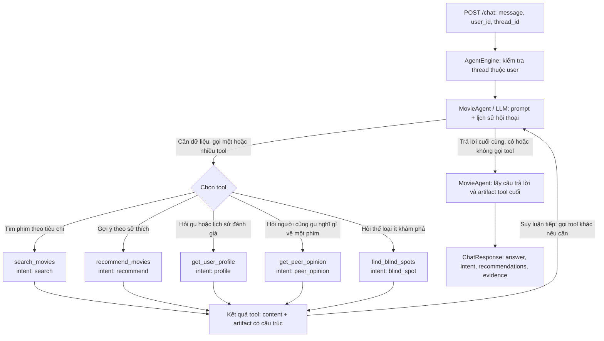

# Báo cáo: Movie Discovery Agent

## Phân Tích Vấn Đề

Người dùng đã có lịch sử MovieLens và muốn khám phá phim bằng ngôn ngữ tự nhiên.
Một đề xuất tốt phải đồng thời: hợp ý định hiện tại, phản ánh sở thích dài hạn,
không vi phạm ràng buộc, chưa được người dùng chấm, và có lý do truy ngược được về
dữ liệu. Vì vậy đây không chỉ là bài toán search.

Ba khó khăn chính là: 51% phim có dưới 5 rating; tag rất thưa; plot dài nhưng truy
vấn ngắn. Ngoài ra hệ thống phải kết hợp tín hiệu content và collaborative, nhớ đề
xuất trước cho câu hỏi follow-up, và tránh để LLM bịa số liệu.

## Phương Pháp Tiếp Cận

Hệ thống gồm Streamlit UI độc lập và FastAPI backend. Lõi `MovieAgent` được xây dựng
bằng `langchain.agents.create_agent` hỗ trợ tool calling với năm công cụ nghiệp vụ:
`recommend_movies`, `search_movies`, `get_user_profile`, `get_peer_opinion`, `find_blind_spots`.
LLM tự động phân tích ngữ cảnh để quyết định gọi tool phù hợp hoặc trả lời trực tiếp
(chào hỏi/small talk) mà không tạo kết quả rác. Lịch sử hội thoại được duy trì bằng
`InMemorySaver` checkpointer theo `thread_id` để phục vụ các câu hỏi follow-up.

### Luồng intent và vòng lặp gọi tool

Agent có thể gọi nhiều tool trong một lượt. Sau khi nhận kết quả tool, LLM
quyết định gọi tiếp tool khác hoặc trả lời. Năm nhánh tool dưới đây tương ứng
với năm intent nghiệp vụ; `conversation` áp dụng khi không gọi tool.

Với lượt không gọi tool (ví dụ chào hỏi), `MovieAgent` gán intent
`conversation`. Với lượt gọi nhiều tool, LLM có thể dùng mọi kết quả tool để
viết `answer`, nhưng các trường có cấu trúc `intent`, `recommendations` và
`evidence` trong `ChatResponse` chỉ lấy từ **artifact của tool cuối cùng trong
lượt đó**, chưa gộp tất cả artifact.

Pipeline recommendation kết hợp:

- TF-IDF word unigram/bigram trên title, genre, tag và plot, có metadata boost.
- Content profile từ các phim người dùng đã chấm, mean-centered theo user.
- User-user collaborative filtering, cosine similarity, minimum overlap và
  shrinkage để giảm độ tin cậy của hàng xóm ít dữ liệu.
- Bayesian movie quality để các phim ít rating không chiếm top chỉ vì mean cao.
- Hard filters cho phim đã xem, genre loại trừ và khoảng năm.

Các object nặng được tạo một lần trong FastAPI lifespan. Với 5.135 phim tĩnh, index
in-memory đơn giản hơn và đủ nhanh; chưa cần một RAG microservice hay vector DB riêng.

### Nhật Ký Quyết Định

| Quyết định                     | Phương án thay thế đã xem xét           | Tại sao tôi chọn phương án này                                                       |
| ----------------------------------- | ------------------------------------------------ | --------------------------------------------------------------------------------------------- |
| Một LangChain tool-calling agent | Supervisor/multi-agent graph                   | Một model đủ chọn năm tool; cấu trúc ngắn, ít latency và dễ mở rộng provider   |
| TF-IDF local trong backend        | Tái sử dụng`rag_service` với Qdrant/Chroma | Corpus nhỏ, static; tránh thêm service và vận hành nhưng vẫn tìm tốt keyword/plot |
| Hybrid content + CF + quality     | Chỉ content, chỉ CF hoặc popularity         | Mỗi tín hiệu bù điểm yếu của tín hiệu khác và cho evidence dễ hiểu            |

## Đánh Giá

Hệ thống được đánh giá bằng 23 bài kiểm thử tự động và các hội thoại mẫu gần với yêu cầu
đề bài. Toàn bộ test hiện đều pass. Các tình huống chính gồm:

| Tình huống kiểm tra                            | Kết quả cần đạt                                         | Kết quả |
| --------------------------------------------------- | -------------------------------------------------------------- | ----------- |
| Đề xuất phim chung cho một user               | Dùng lịch sử rating để đề xuất phim chưa xem        | Đạt     |
| Tìm “dark psychological thriller with a twist” | Trả về phim trong catalog có nội dung phù hợp          | Đạt     |
| Hỏi tiếp “Why would I like that?”             | Giữ được ngữ cảnh của lượt đề xuất trước       | Đạt     |
| Hỏi đánh giá từ người có gu tương tự   | Dùng rating của các user tương đồng và trả evidence | Đạt     |
| Thích Toy Story nhưng không muốn Animation    | Dùng phim tham chiếu nhưng loại đúng genre bị cấm    | Đạt     |
| Yêu cầu Action sau năm 2002                    | Chỉ trả phim Action từ năm 2003 trở đi                 | Đạt     |
| Yêu cầu đúng số lượng phim                 | Không trả nhiều hơn số lượng người dùng yêu cầu  | Đạt     |
| Tìm genre người dùng ít khám phá           | Trả về blind spots cùng phim gợi ý chưa xem            | Đạt     |
| Chào hỏi thông thường                        | Trả lời trực tiếp, không gọi recommendation tool       | Đạt     |
| Kiểm tra grounding                               | Movie ID và evidence trả về đều thuộc dataset          | Đạt     |
| User không tồn tại                             | API từ chối request thay vì tạo recommendation sai       | Đạt     |

### Phân Tích Thất Bại

1. Với “dark psychological thriller with a twist”, `Zero Dark Thirty` có thể lọt
   top do chữ *dark* trong title và genre Thriller dù không phải psychological
   twist. TF-IDF hiểu khớp từ, không hiểu vai trò ngữ nghĩa. Embedding hoặc một
   reranker nhỏ trên top candidates sẽ khắc phục tốt hơn.
2. Với “liked Toy Story but tired of animated movies”, `A Kid in King Arthur's Court` khớp bốn genre nhưng CF chỉ 2.91/5. Query relevance đang có thể lấn át
   tín hiệu dislike. Có thể thêm ngưỡng predicted rating hoặc học weights trên
   validation set.
3. “Blind spot” hiện đo under-exposure tương đối so với catalog, chưa phân biệt
   user cố ý tránh một genre với việc chưa khám phá nó. Cần hỏi lại người dùng hoặc
   dùng cả rating sentiment trước khi gọi đó là điểm mù.

## Suy Ngẫm

Điểm mạnh là retrieval, profile, collaborative filtering và ranking đều chạy local
trên dataset; các score và evidence có cấu trúc không do LLM tự tạo. Luồng hội thoại
end-to-end vẫn cần cấu hình một LLM provider và API key tương ứng. Hard constraints
được thực thi trong recommendation service sau khi agent chuyển chúng thành filter,
qua đó giảm khả năng câu trả lời vượt khỏi dữ liệu đã truy xuất. UI chỉ gọi HTTP, do
đó backend có thể tái sử dụng bởi client khác.

Điểm yếu là TF-IDF thuần chưa nắm tốt các sắc thái ngữ nghĩa tinh tế (như trường hợp
từ khóa trùng lặp nhưng khác ngữ cảnh). Bộ test hiện tập trung vào các luồng chính,
chưa bao phủ đầy đủ lỗi provider, request đồng thời và prompt injection.
Nếu có thêm thời gian, tôi sẽ đánh giá nhiều temporal folds, đo constraint success
và explanation faithfulness, bổ sung semantic reranking, rồi mới cân nhắc tách
retrieval thành microservice khi corpus hoặc tải vận hành thực sự yêu cầu.

## Phần Mở

Thiết kế tách LLM khỏi retrieval/ranking giúp các tín hiệu dữ liệu vẫn kiểm thử và
tái tạo được với cùng tool input. Tuy nhiên đổi provider hoặc model vẫn có thể làm
thay đổi kết quả end-to-end, vì LLM quyết định tool nào được gọi và cách chuyển câu
hỏi thành query, genre, year và reference movie. Do đó cần đánh giá cả chất lượng
tool routing, constraint extraction và grounding của từng model, thay vì chỉ so sánh
độ tự nhiên của câu trả lời.

Các hướng tối ưu tiếp theo được ưu tiên như sau:

1. Mở rộng có điều kiện sang kiến trúc multi-agent. Một orchestrator tiếp nhận yêu
   cầu và chỉ giao việc cho agent chuyên biệt khi cần: agent search/recommendation
   trên dữ liệu local, agent đánh giá evidence và chất lượng kết quả, cùng agent web
   search làm nguồn bổ sung khi catalog không đủ thông tin. Kết quả web phải có nguồn
   trích dẫn và được tách rõ khỏi rating trong dataset. Với yêu cầu đơn giản, hệ thống
   vẫn dùng luồng single-agent hiện tại để tránh tăng latency và chi phí. Retry không
   nên là một agent tự do; nên triển khai thành recovery node hoặc orchestration policy
   có giới hạn số lần thử, timeout và điều kiện dừng để tránh vòng lặp vô hạn.
2. Thêm semantic retrieval hoặc cross-encoder reranker trên candidate pool của
   TF-IDF để hiểu tốt hơn theme, mood và quan hệ ngữ nghĩa nhưng vẫn giữ hard filter
   cùng khả năng truy vết evidence.
3. Xây dựng search evaluation riêng để cấu hình và so sánh các phương án retrieval.
   Bộ đánh giá gồm các query cố định cho keyword search, semantic search, genre/year
   filter, negative constraint và truy vấn không có kết quả. Các tham số như metadata
   boost, candidate pool, semantic threshold và trọng số kết hợp được đưa vào config;
   mỗi thay đổi phải chạy lại bộ đánh giá để chọn cấu hình tốt hơn trước khi release.
4. Thay `InMemorySaver` bằng checkpoint store có TTL và giới hạn context; bind
   `thread_id` với user đã đăng nhập, thêm rate limit, timeout, tracing và readiness
   check trước khi triển khai nhiều worker.
